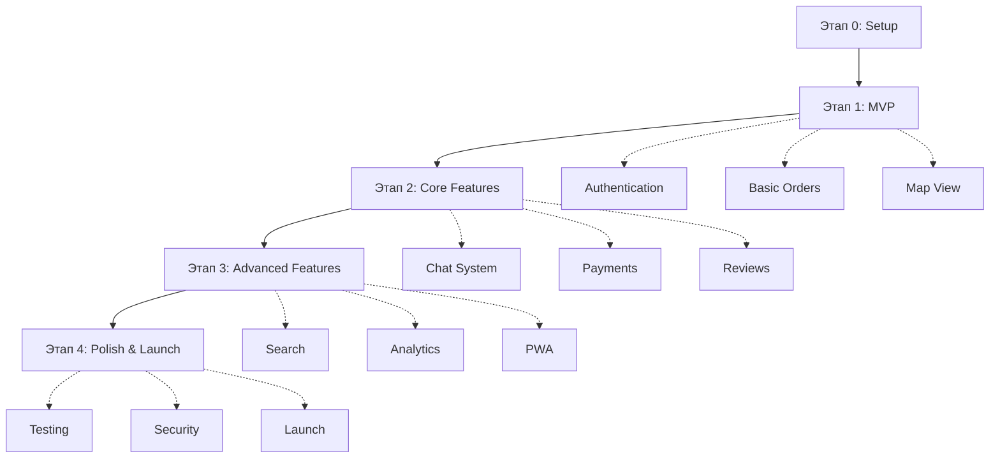

# План этапов разработки Pluribus

## Обзор

Разработка платформы Pluribus разделена на 5 основных этапов, каждый из которых строится на предыдущем и добавляет новый функционал.

**Общая структура:**
```
Этап 0: Подготовка (Setup) →
Этап 1: MVP →
Этап 2: Core Features →
Этап 3: Advanced Features →
Этап 4: Polish & Launch
```

---

## Этап 0: Подготовка (Setup Phase)

**Цель**: Настроить все необходимое окружение для разработки

**Ключевые задачи:**
- Инициализация репозитория (Git, branching strategy)
- Настройка Frontend окружения (React + TypeScript + Vite)
- Настройка Backend окружения (Node.js + Express + TypeScript)
- Database setup (PostgreSQL + Redis + Prisma)
- CI/CD Pipeline (GitHub Actions)
- Development tools (Docker Compose, Environment variables)
- Project documentation (README, CONTRIBUTING, Standards)

**Детальное описание**: См. [phase_0_setup.md](./phase_0_setup.md)

**Критерии завершения:**
- ✓ Frontend и Backend проекты инициализированы
- ✓ База данных подключена и работает
- ✓ CI/CD pipeline настроен
- ✓ Документация создана
- ✓ Команда может начать разработку

---

## Этап 1: MVP (Минимально жизнеспособный продукт)

**Цель**: Создать базовую рабочую версию с ключевыми функциями

**Основной функционал:**
1. **Authentication System** - Email/Password регистрация и логин, JWT токены
2. **User Profiles** - Просмотр и редактирование профиля, выбор роли (buyer/seller)
3. **Product Management** - CRUD операции для товаров (для Seller)
4. **Map View** - Google Maps с активными продавцами, кластеризация (для Buyer)
5. **Orders (Базовый)** - Создание и просмотр заказов, базовые статусы
6. **UI/UX (MVP дизайн)** - Landing, Login/Register, Dashboard

**Детальное описание**: См. [phase_1_mvp.md](./phase_1_mvp.md)

**Критерии завершения:**
- ✓ Пользователи могут регистрироваться и входить
- ✓ Sellers могут добавлять товары
- ✓ Buyers могут видеть продавцов на карте
- ✓ Можно создать и получить заказ
- ✓ Базовая навигация работает

---

## Этап 2: Core Features (Основной функционал)

**Цель**: Расширить MVP до полнофункциональной платформы

**Основной функционал:**
1. **Google OAuth Integration** - Вход через Google
2. **Custom Orders System** - Индивидуальные заказы с возможностью принять/отклонить
3. **Enhanced Product Management** - Множественные фото, категории, детальные описания
4. **Order Management Enhancement** - Расширенные статусы, tracking, история
5. **Real-time Chat** - WebSocket чат между buyer и seller
6. **Rating & Review System** - Обязательная взаимная оценка после заказа
7. **Payment Integration (Stripe)** - Платежная система с escrow механизмом
8. **Advanced Map Features** - Фильтры, поиск, детальные карточки продавцов

**Детальное описание**: См. [phase_2_core.md](./phase_2_core.md)

**Критерии завершения:**
- ✓ Google OAuth работает
- ✓ Custom orders полностью функциональны
- ✓ Real-time чат работает стабильно
- ✓ Система рейтингов работает
- ✓ Stripe платежи интегрированы
- ✓ Все API endpoints документированы

---

## Этап 3: Advanced Features (Продвинутые возможности)

**Цель**: Добавить продвинутые фичи для улучшения UX и масштабирования

**Основной функционал:**
1. **Comprehensive Notification System** - Push, Email, In-app уведомления
2. **Search & Filtering (Elasticsearch)** - Полнотекстовый поиск, faceted filtering
3. **Analytics & Statistics Dashboard** - Статистика для sellers и admins
4. **User Verification System** - Email, Phone, ID verification
5. **Dispute Resolution System** - Система споров и разрешения конфликтов
6. **Favorites & Social Features** - Избранное, подписки, referral program
7. **Internationalization (i18n)** - Поддержка 4 языков (EN, RU, ES, ZH)
8. **Image Optimization & CDN** - Cloudinary integration, автоматическая оптимизация
9. **Advanced Payment Features** - Множественные методы оплаты, invoices
10. **Performance Optimization** - Redis caching, query optimization, code splitting
11. **Mobile Responsiveness & PWA** - Progressive Web App, offline support
12. **Admin Panel (Basic)** - Управление пользователями, orders, disputes

**Детальное описание**: См. [phase_3_advanced.md](./phase_3_advanced.md)

**Критерии готовности:**
- ✓ Performance metrics достигнуты (Lighthouse 90+)
- ✓ Elasticsearch работает стабильно
- ✓ Многоязычность функционирует
- ✓ Admin панель доступна
- ✓ PWA работает офлайн
- ✓ Security audit пройден

---

## Этап 4: Polish & Launch (Полировка и запуск)

**Цель**: Подготовить продукт к production и успешно запустить платформу

**Основные активности:**
1. **Comprehensive Testing** - Unit, Integration, E2E, Load testing
2. **Security Hardening** - Security audit, penetration testing, OWASP Top 10
3. **Legal & Compliance** - ToS, Privacy Policy, GDPR compliance
4. **Admin Panel (Complete)** - Полнофункциональная админ-панель
5. **Documentation** - API docs, User guides, FAQ, Video tutorials
6. **Performance & Monitoring** - Lighthouse audit, Sentry, Datadog, Analytics
7. **Production Deployment** - Staging & Production environments, CI/CD finalization
8. **Marketing Preparation** - Landing page, SEO, Social media, Press kit
9. **Beta Testing** - Closed beta с 50-100 пользователями
10. **Soft Launch** - Limited geographic rollout, monitoring
11. **Post-Launch Activities** - Support setup, Community management, Regular updates

**Детальное описание**: См. [phase_4_launch.md](./phase_4_launch.md)

**Критерии готовности к запуску:**
- ✓ Все тесты проходят
- ✓ Security audit completed
- ✓ Legal documents published
- ✓ Performance targets met
- ✓ Beta testing successful
- ✓ Support team ready
- ✓ Monitoring operational
- ✓ First 100 orders completed successfully

---

## Сводная таблица этапов

| Этап | Название | Основные цели | Ключевые технологии |
|------|----------|---------------|---------------------|
| 0 | Setup | Подготовка окружения | Git, Docker, Prisma, CI/CD |
| 1 | MVP | Базовый функционал | React, Express, PostgreSQL, Google Maps |
| 2 | Core Features | Полноценная платформа | Socket.io, Stripe, OAuth |
| 3 | Advanced Features | Масштабирование и UX | Elasticsearch, Redis, PWA, i18n |
| 4 | Polish & Launch | Продакшен запуск | Testing, Monitoring, Analytics |

---

## Зависимости между этапами



---

## Общие принципы разработки

### Agile подход
- Итеративная разработка
- Регулярные спринты (2 недели)
- Daily standups
- Sprint reviews и retrospectives

### Quality Assurance
- Code reviews обязательны
- Automated testing на каждый PR
- Continuous Integration
- No deploy without tests

### Documentation First
- Документировать перед кодированием
- API specs перед implementation
- README для каждого модуля

### Security by Design
- Никогда не хранить секреты в коде
- Validation на всех входах
- HTTPS everywhere
- Regular security audits

### Performance Matters
- Monitor everything
- Optimize early
- Set performance budgets
- Regular performance audits

---

## Команда и роли

### Минимальная команда для старта:
- **1-2 Full-stack разработчика** (могут покрыть этапы 0-2)
- **1 UI/UX дизайнер** (параллельно с этапом 1)
- **1 DevOps инженер** (от этапа 2)
- **1 QA Engineer** (от этапа 3)
- **1 Product Manager** (на всех этапах)

### Расширенная команда (этап 3-4):
- **Backend team** (2-3 developers)
- **Frontend team** (2-3 developers)
- **QA team** (2 engineers)
- **DevOps** (1-2 engineers)
- **Customer Support** (2-3 agents)
- **Marketing** (1-2 marketers)
- **Community Manager** (1)

---

## Инструменты для управления проектом

### Project Management:
- **Jira** или **Linear** - task tracking
- **Confluence** - documentation
- **Slack** - team communication
- **Figma** - design collaboration

### Development:
- **GitHub** - code repository
- **GitHub Actions** - CI/CD
- **Postman** - API testing
- **Sentry** - error tracking
- **Datadog** - monitoring

### Collaboration:
- **Google Workspace** - docs, sheets
- **Notion** - knowledge base
- **Loom** - video documentation
- **Miro** - brainstorming

---

## Риски и митигация

| Риск | Вероятность | Влияние | Митигация |
|------|-------------|---------|-----------|
| Задержки в разработке | High | High | Buffer time в планах, agile подход |
| Технические сложности (Stripe, Maps) | Medium | High | Proof of concepts рано, запасные решения |
| Нехватка ресурсов | Medium | High | Приоритизация фич, MVP first |
| Security breaches | Low | Critical | Regular audits, security first |
| Low user adoption | Medium | High | Beta testing, user research, marketing |
| Payment processing issues | Low | Critical | Thorough testing, Stripe support |
| Scaling problems | Medium | Medium | Performance testing, monitoring, cloud auto-scaling |

---

## Успех метрики

### Этап 1 (MVP):
- Работающий прототип
- 5 тестовых пользователей могут выполнить заказ
- Все базовые флоу работают

### Этап 2 (Core):
- 50+ зарегистрированных пользователей
- 10+ завершенных заказов
- Payment integration работает
- Положительные отзывы от тестеров

### Этап 3 (Advanced):
- 200+ пользователей
- 50+ завершенных заказов
- Performance benchmarks met
- Security audit passed

### Этап 4 (Launch):
- Public launch successful
- 500+ users first month
- 100+ завершенных заказов
- < 1% error rate
- 4.0+ average rating

---

## Следующие шаги после завершения всех этапов

1. **Continuous Improvement**
   - Regular feature updates
   - Bug fixes
   - Performance optimizations
   - User feedback integration

2. **Expansion**
   - New markets/countries
   - Mobile native apps
   - B2B features
   - Partnership integrations

3. **Scaling**
   - Infrastructure scaling
   - Team expansion
   - Process optimization
   - Automation

4. **Innovation**
   - AI/ML for recommendations
   - Blockchain for transparency
   - AR for product preview
   - Voice interface

---

## Заключение

Этот план разработки обеспечивает структурированный подход к созданию платформы Pluribus от начальной настройки до публичного запуска. Каждый этап строится на предыдущем, обеспечивая solid foundation для следующего.

**Ключ к успеху:**
- Следовать плану, но быть гибкими
- Тестировать рано и часто
- Слушать пользователей
- Приоритизировать качество над скоростью
- Инвестировать в автоматизацию

**Готовы начать? Переходите к [Этапу 0: Setup](./phase_0_setup.md)!** 🚀
